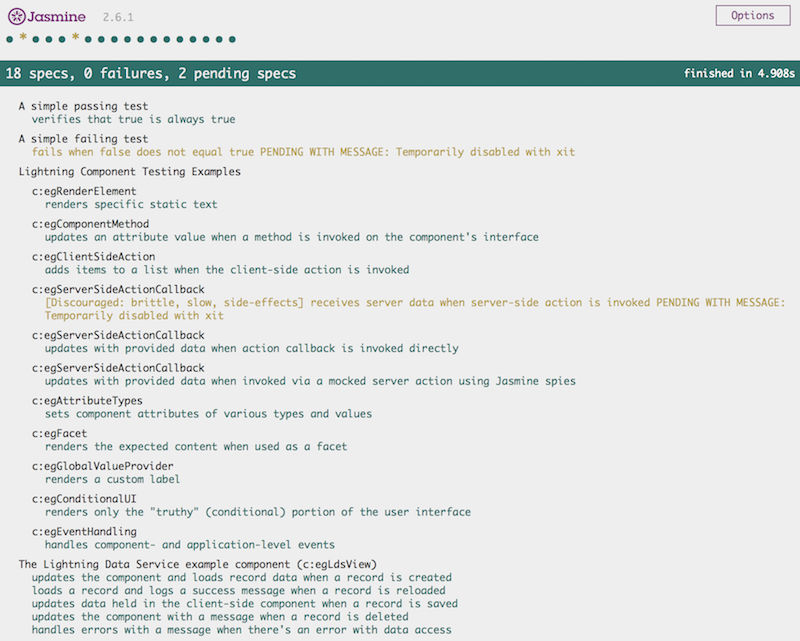
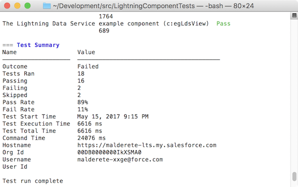

# Lightning Testing Service (LTS) [](https://travis-ci.org/forcedotcom/LightningTestingService) [](https://circleci.com/gh/forcedotcom/LightningTestingService/tree/master)
## Pilot Program

The Lightning Testing Service, or LTS, is a set of tools and services that let you create test suites for your Lightning components using standard JavaScript test frameworks, such as Jasmine.

Automated tests are the best way to achieve predictable, repeatable assessments of the quality of your custom code. Writing automated tests for your custom components gives you confidence that they work as designed, and allows you to evaluate the impact of changes, such as refactoring, or of new versions of Salesforce or third-party JavaScript libraries.

## About the Pilot Program

> We provide the Lightning Testing Service (LTS) to selected customers through a pilot program that requires agreement to specific terms and conditions. To be nominated to participate in the program, contact Salesforce. Pilot programs are subject to change, and we can’t guarantee acceptance. LTS isn’t generally available unless or until Salesforce announces its general availability in documentation or in press releases or public statements. We can’t guarantee general availability within any particular time frame or at all. Make your purchase decisions only on the basis of generally available products and features.

The LTS supports testing with standard JavaScript test frameworks. During the pilot program we’re providing an easy-to-use wrapper for using [Jasmine](https://jasmine.github.io/). If you’d like to use an alternative test framework, you’ll have to wrap it yourself. (See [Next Steps](#next-steps) for some details.) We look forward to your feedback about Jasmine, and other test frameworks you have experience with.

If you’re a part of the official, limited pilot for LTS, please provide feedback through the pilot forum and review meetings. If you’re not a part of the official pilot, we’d still love your suggestions. Please log issues through the GitHub repo.

## Lightning Testing Service Overview

During the pilot program there are two ways you can use the Lightning Testing Service.

 * If you just want to “kick the tires,” install the LTS unmanaged package. The package provides the test service app and an example test suite. It also includes example components that the test suite runs against. You run the test suite by accessing the URL for the LTS app in your org. Everyone should start with this package.
 
 * If you plan to evaluate or use LTS in more depth, you’ll want to use it with [Salesforce DX](https://developer.salesforce.com/platform/dx), which is available as an open beta. Once you install the salesforcedx CLI plugin, you can work with your test suite in a variety of ways from the command line. This approach is recommended for systematic automated testing.

Write your tests using a JavaScript testing framework of your choosing. We provide an easy-to-use wrapper for [Jasmine](https://jasmine.github.io/). A simple Jasmine test looks like the following:

```js
/**
 * This is a 'hello world' Jasmine test spec file
 */
describe("A simple passing test", function() {
    it("checks that true is always true", function() {
        expect(true).toBe(true);
    });
});
```

You can write your own wrapper if you prefer a different testing framework. The LTS also provides utilities specific to the Lightning Component framework, which let you test behavior specific to Lightning components.

Your test suite is deployed in the form of an archive (zip) static resource. Once the LTS is installed and configured (we’ll get to that next), you make changes to your test suite, create the archive, and upload it to your org. Then you run the test suite via one of the two mechanisms outlined.

> **Important:** Don't run tests in your production org. The LTS doesn't provide an isolated test context or transaction wrapper. DML operations you perform in your tests won't be rolled back at the end of the test. We recommend that you run your LTS test suites _only_ in scratch orgs, using data provided by the test suite itself.

## Installing the Lightning Testing Service

There are two stages of installing the LTS. First install the unmanaged package. Then, optionally, install the latest salesforcedx CLI plugin to use the LTS with the `sfdx` command line tool.

### Install the LTS Unmanaged Package

Installing the LTS package is just like [installing any other unmanaged package](https://help.salesforce.com/articleView?id=distribution_installing_packages.htm&language=en&type=0).

1. Log in to your org. We recommend that you create a new DE org for evaluating the LTS.
2. Go to the project [Releases](https://github.com/forcedotcom/LightningTestingService/releases) page, and click the package installation URL for the latest release.
3. Authenticate again with the credentials for your DE org.
4. Follow the normal package installation prompts. We recommend installing the package for admins only.

The LTS package installs the following items:

 * Example test suites
     - Jasmine JavaScript files in archive static resources
 * Example components to be tested
     - Components, an Apex class, and a custom label
 * LTS infrastructure
     - Jasmine framework and wrapper
     - LTS test utilities
     - Test runner component
     - Wrapper test app

Once installed, you can run the example test suite by going to the following URL in your org:
<code>https://<em>&lt;myServer&gt;</em>/c/jasmineTests.app</code>

You should see a screen that looks something like the following.



This page tells you that the package is correctly installed and LTS is working in your org.

## Install the Lightning Testing Service for Salesforce DX

The salesforcedx CLI plugin for Salesforce DX allows you to use the `sfdx` command line tool to perform automated testing as part of your development process, including automated process, such as continuous integration.

### Prerequisites

Before you install and use the LTS with the salesforcedx CLI plugin, you must first do the following.

 * Join the [Salesforce DX](https://developer.salesforce.com/platform/dx) open beta and install the Salesforce CLI
 * Configure a Dev Hub for use with Salesforce DX
 * Recommended: Install Force.com IDE 2, if you want to use the IDE
    
    Note that Force.com IDE 2 is a beta version that is available only as part of the Salesforce DX open beta. It’s not strictly required for using Salesforce DX or the LTS, but it provides usability improvements for both.

### Installation

Install the pilot version of the LTS for Salesforce DX by running the following command in your command line shell.

```bash
sfdx plugins:install salesforcedx
```

After you install the salesforcedx CLI plugin, you can run your tests from the command line using the `sfdx` tool. For example:

```bash
sfdx force:auth:web:login -s     # connect to your scratch org
sfdx force:source:push           # push local source to the scratch org
sfdx force:lightning:test:run    # run the test suite
```

When you run the `force:lightning:test:run` command in a connected workspace you should see something like the following:



This tells you that the command line tools are working, and connected to your development org.

# Next Steps

When you have the LTS package installed and working in your org, you’re ready to begin exploring the test code, and even writing your own tests. Here are some next steps for you to take.

## Explore the Example Test Suite

To dive into the test suite and start learning how to write tests for your Lightning components, explore the tests and the components being tested side-by-side. You’ll want to open the test suite file in one window, and in another window (perhaps in your IDE) open the simple components being tested.

Both the components and the test suite included in the unmanaged package are also available in a repository on GitHub:

[https://github.com/forcedotcom/LightningTestingService](https://github.com/forcedotcom/LightningTestingService)

### Components for Testing

All of the testable components are named beginning with “eg” (from the abbreviation “e.g.”, meaning _for example_). The components provided in the package can be accessed as you would any Lightning component.

 * In the Developer Console
 * In the Force.com IDE, in the `/aura/` directory
 * By converting your org’s metadata into a format that you can work with locally, using Salesforce DX

You can also explore the components directly from the repo. They’re available in the [lightning-component-tests/main/default/aura](https://github.com/forcedotcom/LightningTestingService/tree/master/lightning-component-tests/main/default/aura) directory.

There are more than a dozen different components, designed to be used in illustrative tests. Each of the components has a description of its behavior in its `.auradoc` documentation file.

### Test Suite

The example tests are included in the form of static resources. You can also review them directly in the repo, in the [lightning-component-tests/test/default/staticresources](https://github.com/forcedotcom/LightningTestingService/tree/master/lightning-component-tests/test/default/staticresources) directory.

There are three test suites included in the LTS package:

 * `helloWorldTests.resource` — A very simple example including one passing and one failing test.
 * `exampleTests.resource` — The example test suite that’s worth your time to review.
 * `lightningDataServiceTests.resource` — Some examples specific to testing Lightning Data Service-based components.

The remainder of the static resources are infrastructure used by the LTS. They’re _briefly_ described in [Use Another JavaScript Test Framework](#use-another-javascript-test-framework).

The `exampleTests.resource` is a single JavaScript file containing a complete test suite. It’s a single file for convenience in delivery and exploration. Your own test suites can include many such files. `exampleTests.resource` is copiously commented. For the pilot program, the code and comments serve as the official documentation for how to write tests.

## Write Your Own Tests

A separate document, [Testing Lightning Components with the Lightning Testing Service](https://github.com/forcedotcom/LightningTestingService/blob/master/developer-workflow.md), describes the flow, or lifecycle, of using the LTS to automate your testing. Once you’ve explored the example tests, use this document to dive into writing a test suite for your own custom components.

## Use Another JavaScript Test Framework

The Lightning Testing Service provides a way to use standard JavaScript test frameworks with your Lightning components. For the LTS pilot we’ve provided the example test suite implemented in [Jasmine](https://jasmine.github.io/). Jasmine is one of several well-regarded test frameworks, and if you haven’t chosen one already, we recommend you start with it.

If you’d prefer to use another test framework, either because you’ve already selected one, or because you find something more to your taste, you can use it with the LTS instead. During the pilot that’s a little more work. Please do tell us which frameworks you’re using, so we can consider them for later versions of the LTS.

All of the packaged pieces of the LTS are included in the project repository, in the [lightning-component-tests/test/default](https://github.com/forcedotcom/LightningTestingService/tree/master/lightning-component-tests/test/default) directory. The pieces you’ll need to modify or replace are the following items.

 * `jasmineTests.app` — The front end of the LTS, this simple app includes the test runner component, and a list of test suites to feed it.
 * `BaseTestRunnerCmp` — The test runner component for Jasmine. It includes references to the required Jasmine library, which it loads along with the test spec resources, and then fires the test runner.
 * `jasmine.resource` — The Jasmine library, unmodified.
 * `jasmineboot.resource` — A JavaScript IIFE that launches Jasmine in the LTS context.
 * `jasmineReporter.resource` — Another JavaScript IIFE, used to adapt Jasmine’s results into formats expected by LTS and Salesforce DX.
 * `testutil.resource` — A collection of utilities for use within your test specs. They provide Lightning component-specific functions that make it easier to test your custom components from a test context.

If you’re already experienced with setting up another test framework, adapting the pilot Jasmine examples should take you a day or so, but not longer. We’d be thrilled to hear more about your adventures with Mocha and other JavaScript test frameworks!
